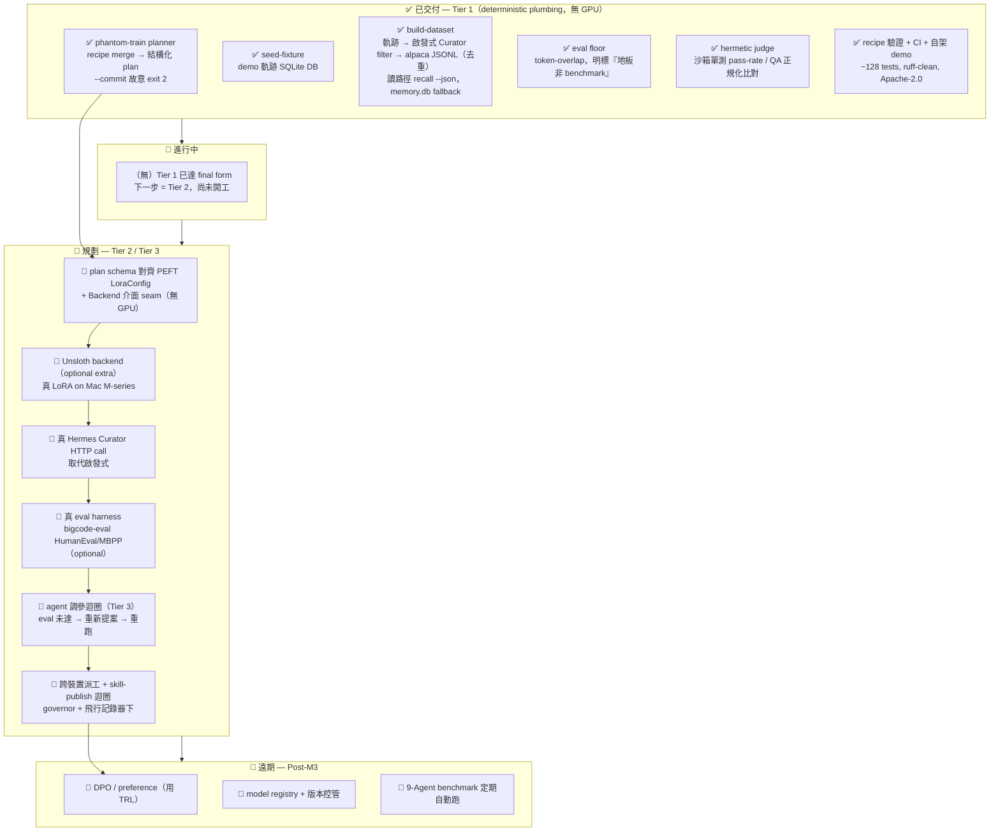

> ARCHIVED 2026-06-19 — 內容已併入 docs/phantom-training.md;此為歷史版本。

# 路線圖（繁中視覺版）🗺️

> ⚠️ **狀態唯一真相在英文版 [`ROADMAP.md`](ROADMAP.md)**。本檔是視覺化導覽 + 開發排序，
> 不重述狀態；衝突一律以 `ROADMAP.md` 為準。選型方向見
> [`docs/OSS-LANDSCAPE-AND-DIRECTION.md`](docs/OSS-LANDSCAPE-AND-DIRECTION.md)。
> 最後更新：2026-06-19。

## ① 一行定位 + 護城河

**一行定位**：phantom-mesh 上的 **headless + agentic + 跨裝置** post-training 編排器 —
把「你自己的 agent 軌跡」練成一個「懂你的小模型」，再回餵成 phantom skill。

**護城河 🏰（別人沒有、也不該由別人擁有的三件事）**：
1. 🔒 **資料來自你自己的軌跡**（支援路徑 = `phantom recall --json` live timeline，`memory.db` 為 fixture/Tier-2 fallback；**注意** `events.sqlite/fts5_events` 是 dead scaffolding，非來源），非公開 dataset
2. ⚖️ **Hermes Curator 篩成功 case**（Tier-1 為**啟發式** filter，已 ship；**真 Hermes HTTP call 是 Tier-2 規劃**）+ **hermetic 真 judge**（沙箱跑單測 pass-rate，已 ship，可在無 GPU/無網的乾淨機器重現）
3. 🛰️ **跨 mesh GPU node 派工**（在 governor + 飛行記錄器下把訓練丟到有 GPU 的節點）

**刻意定位**：不寫 trainer、不做 Web UI —— 站在 Unsloth/Axolotl 肩膀上做「編排 + 來源證明 + 誠實 eval」。

---

## ② 狀態流 Mermaid（✅ 已交付 → 🚧 進行中 → 📅 規劃 → 🔭 遠期）

---

## ③ 分期表（在哪台機 + 哪 AI + 風險前置）

> 排序原則：**便宜高值先 → 護城河先 → 需 GPU/裝置/操作者決策的後做**。
> 開發模型：單人多機（z13 / M5 / M1 / acer / ayaneo / Android）；**寫 = codex/claude，
> 審 ≥ 2 個 distinct-AI，governor + 雙閘 → 手機核可**。OSS 選型只標「候選方向」。

| 階段 | 目標 | 具體項（2–4，grounded） | 在哪台機 + 哪 AI | 風險前置 ⚠️ |
|---|---|---|---|---|
| **S0 · 便宜高值**（無 GPU，先做）| 把 Tier-2 接口長好但不訓練 | • plan schema 對齊 PEFT `LoraConfig` • 定義 `Backend.train(plan,dataset)→adapter_path` seam（no-op/dry-run 實作） • 維持 hermetic 套件全綠 | **z13**（Win）寫=codex，審=claude+agy；純 Python 重活可丟 **acer/ayaneo** | 介面定錯→Tier-2 重工。先寫 schema 測試鎖死；**[候選方向] PEFT** |
| **S1 · 護城河**（無 GPU）| 把真實來源/判斷接上 | • 真 Hermes Curator HTTP call 取代啟發式 • `phantom recall --json` 主路徑強化、`memory.db` fallback • 資料健檢（格式/洩漏/token 長度） | **z13** 寫=codex，審=claude+opencode；需 phantom-mesh serve 在本機 | recall 軌跡資料量可能不足 → 先靠 ai-feed/companion 灌 + 日常累積；serve 介面飄移 → 先鎖 contract 測試 |
| **S2 · 真訓練**（需 GPU/裝置）| 第一個真 LoRA | • Unsloth backend（`phantom-training[unsloth]` optional，subprocess 隔離） • 真 LoRA on **Mac M-series** • bigcode-eval HumanEval/MBPP（optional gate） | 寫=codex/claude on **z13**；**真訓練在 M1/M5（Mac M-series）或有 GPU 的 mesh node** | ⚠️ Mac M1 16GB 只能 ≤4B；**Unsloth 雙授權（Apache+AGPL）需先做授權盤點**[候選方向]；Windows Defender 鎖 target |
| **S3 · agentic + 派工**（需操作者決策）| 自動調參 + 跨機 | • agent 調參迴圈（DSPy/LaMDAgent 風格，eval miss → 重提案重跑） • 跨裝置派工（mesh capability dispatcher） • skill-publish 回 phantom-mesh | 寫=codex/claude；派工跨 **acer/ayaneo/Android/Mac**，**governor 雙閘 → 手機核可** | 派工=高風險動作 → 強制 governor 暫停 + 手機核可；自評 overfit → 強制 public eval set |
| **S4 · 遠期**（Post-M3）| 偏好學習 + 治理 | • DPO/preference（TRL） • model registry + 版本控管 • 9-Agent benchmark 定期跑 | 寫=codex/claude，審 ≥2 AI；訓練在 GPU node | 範圍易爆 → 全列 optional extra；**[候選方向] TRL** |

---

## ④ 刻意不做 / over-build 表 🚫

| 不做 | 為什麼 | 改用 |
|---|---|---|
| 🚫 自己寫 trainer（SFT/LoRA/GRPO kernels）| 紅海且更新極快，自寫=純負債 | **包** Unsloth / Axolotl（候選） |
| 🚫 Web UI | LLaMA-Factory 已壟斷零碼 UI；本專案價值=headless + agent 驅動 | UI 留在 phantom-mesh 內 |
| 🚫 把 trainer / public benchmark 設成硬相依 | 會破壞「乾淨機器無 GPU 可重現」這個最大資產 | 一律 **optional extra**，hermetic floor 保持零相依 |
| 🚫 製造合成資料當主力 | 護城河是「真軌跡來源 + Hermes 成功訊號」 | distilabel / Curator 只當**參考模式** |
| 🚫 支援所有框架 | secure-connector 的「全都支援」陷阱（DESIGN.md §5）| 先做**一個真的會動**的 backend（Unsloth） |
| 🚫 從零 pretrain / 多模態 / 雲端 SaaS | 違反 local-first、且非利基 | 只做 fine-tune/DPO、text、self-hosted |
| 🚫 README 過度宣稱 | 維持 Tier-1 誠實註記：plan ≠ 訓練、floor ≠ benchmark | 每個 backend 等**真的端到端跑通**才宣稱 |

---

*繁中視覺導覽，grounded in [`ROADMAP.md`](ROADMAP.md) +
[`docs/OSS-LANDSCAPE-AND-DIRECTION.md`](docs/OSS-LANDSCAPE-AND-DIRECTION.md)。
狀態以英文 `ROADMAP.md` 為準。*
