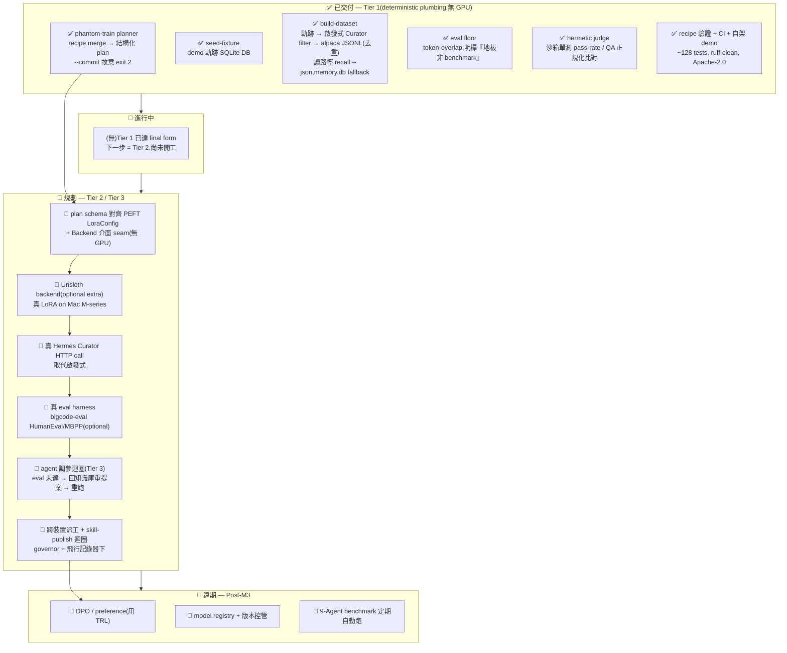

# phantom-training — 唯一主文件

> 本檔為 phantom-training 唯一主文件;舊版見 `docs/_archive/`。
> 對應狀態:`master` @ `770f28d` — Tier 1(deterministic plumbing)已出貨:`phantom-train` CLI(`planner` / `seed-fixture` / `build-dataset` / `eval` / `judge`)、~128 passing tests、ruff-clean、Apache-2.0。**Tier 1 是確定性管線,不是 LLM agent、也不是真訓練**;agentic 調參與真 fine-tune(Unsloth)在 Tier 2/3。每個「已出貨」項都對應 `master` 上的真實 commit。

## 目錄
- [這是什麼(一句話)](#這是什麼一句話)
- [它怎麼運作(知識庫 + 優化循環)](#它怎麼運作知識庫--優化循環)
- [各類模型(範圍)](#各類模型範圍)
- [方向與願景(locked, extended)](#方向與願景locked-extended)
- [定位與護城河](#定位與護城河)
- [快速上手](#快速上手)
- [狀態與視覺路線圖](#狀態與視覺路線圖)
- [開源生態與方向](#開源生態與方向)
- [刻意不做 / over-build 風險](#刻意不做--over-build-風險)

---

## 這是什麼(一句話)

**phantom-training 是 PHANTOM 用來訓練各類模型的「知識庫 + 優化循環」。**

白話講:它是 PHANTOM(那個 agent)學會「怎麼訓練模型」的大腦。裡面有兩個互相咬合的東西:

1. **知識庫(Knowledge Base)** —— 一個累積「怎麼訓練模型」的知識/配方倉庫:訓練方法、recipe、config、什麼資料該配什麼方法、eval 怎麼判好壞。PHANTOM 從這裡抽配方來訓練模型。
2. **優化循環(Optimization Loop)** —— 一圈一圈把模型(以及知識庫本身)變好:確定性 eval 地板 + 真沙箱 judge → 評分 → 提案改進(換 recipe / 加資料)→ 再訓練 → 比較。真正對外/真訓練的動作都走 governor + 手機核可。

重點在「**各類模型**」:不只 LLM,而是 PHANTOM 可能要訓練的各種模型(例如「懂你的小模型」、skill 模型、分類/排序模型……),知識庫要能涵蓋多種模型型態的訓練方法。

> 它**不是**訓練器,也絕不該變成訓練器。它站在 Unsloth / Axolotl 這些訓練引擎的肩膀上,只做別人沒有、也不該由別人擁有的那層:**餵方法的知識庫 + 把結果變好的優化循環 + 來源溯源 + 評估誠實性**。

---

## 它怎麼運作(知識庫 + 優化循環)

### 知識庫(Knowledge Base):agent 從這裡抽配方

**它是什麼:** 一個結構化的「訓練配方倉庫」。每一筆配方大致回答這幾件事 —— 要訓什麼型態的模型、用哪個 base、用什麼方法(SFT / LoRA / DPO …)、超參怎麼設(lora_rank / lr / epochs)、配什麼資料、用什麼 eval 判好壞。

**一個具體例子:**

> 你想訓一個「懂你寫 code 風格」的小模型。
> → agent 去知識庫找「**小模型 + LoRA + 你的軌跡資料**」這個配方,
> → 把配方套上去(填入 base = Qwen2.5-Coder-7B、lora_rank、你的 Rust session 當資料),
> → 產出一份結構化的 fine-tune **plan**。

**它怎麼長大:** 知識庫的形狀**參考**業界最高品質的開放 recipe 集(open-instruct / Tülu 的 `configs/`、axolotl/LLaMA-Factory 的 `examples/`),把這些「config 形狀」對映成 phantom 的 plan schema。每跑完一圈優化循環、有了「這個配方在這種資料上效果如何」的結果,就回寫進知識庫,讓下一次抽配方更準。

> 今天的真實狀態:已出貨的是 `phantom-train` planner —— 它會**合併 recipe 預設、印出結構化 plan**(`examples/rust-coder.toml` 就是一個 recipe)。「agent 自動從知識庫挑配方」「knowledge base 隨循環自我增長」屬 Tier 2/3 願景,尚未開工。

### 優化循環(Optimization Loop):一圈一圈變好

**它是什麼:** 一個「訓 → 評 → 提案 → 再訓 → 比較」的迴圈,核心是**誠實的評分**:用一個無 GPU、無網、可在乾淨機器重現的 eval 地板,加一個真沙箱 judge,確保「變好」是真的變好,不是模型自吹自擂。

**一個具體例子:**

> 1. 用 eval **地板**判分(確定性切分 + 最近指令檢索 baseline,exact-match + token-F1),
> 2. 用 **judge** 看品質(程式碼候選 → 丟沙箱子行程跑單元測試,看通過率;QA → 正規化比對),
> 3. 分數不夠 → agent **提案**「換個 recipe / 加一批資料 / 調 lora_rank」,
> 4. **再訓**一次,
> 5. **比較**新舊版本;通過就 publish 成 phantom skill,沒過就回到第 3 步重提案。
> 全程「真訓練」這個高風險動作由 **governor** 把關,**手機核可**才放行,**flight-recorder** 記錄。

> 今天的真實狀態:已出貨的是這個循環的**地板與 judge** —— `eval`(token-overlap 地板,明標「是地板,不是 benchmark」)+ `hermetic_judge.py`(沙箱單測 pass-rate / QA 比對,接進 `is_success`)。「agent 自動提案再訓」「跨機派工真訓練」屬 Tier 3 願景。

### 兩者怎麼咬合

知識庫**餵方法**(抽出一個配方 → plan),優化循環**把結果變好**(評分 → 提案 → 再訓 → 比較),循環得到的結果又**回寫進知識庫**。這就是 phantom-training 的脊椎。

---

## 各類模型(範圍)

「各類模型」是這個專案的定位核心:知識庫不該只懂訓 LLM,要能涵蓋 PHANTOM 實際會用到的多種模型型態。範圍如下:

| 模型型態 | 例子 | 知識庫怎麼涵蓋 |
|---|---|---|
| **「懂你」的小模型** | 用你自己的 agent 軌跡訓一個懂你 code 風格 / 偏好的小 LLM | LoRA / QLoRA on 小 base(≤7B)+ 你的軌跡資料的配方 |
| **skill 模型** | 把某個常用 phantom skill(如 rust-coder)蒸餾成專屬微調模型 | SFT instruction-tuning 配方,結果回餵成 phantom skill |
| **分類 / 排序等輔助模型** | 判斷一段對話是否「成功」、把候選結果排序的小模型 | 較輕的監督式配方(非生成式 LLM 也納入知識庫的方法型態);判分上,沒有 ground truth 的列由已出貨 judge 的 Tier-1 寬鬆 column-check fallback(additive)兜底 |
| **(遠期)偏好對齊** | 用 DPO/preference 把模型對齊你的偏好 | TRL 風格 DPO 配方,屬 Post-M3 願景 |

> 重點:**知識庫要能涵蓋多型態的訓練方法**,不是只塞 LLM SFT 一種。今天已落地的是 LLM 小模型 / skill 模型方向的確定性管線;分類/排序與偏好對齊是知識庫要逐步擴的方法型態。

---

## 方向與願景(locked, extended)

> 這一節是**已鎖定的方向**;下方〈狀態與視覺路線圖〉是**已出貨的真實狀態**。兩者分開,不混淆「願景」與「已做」。

**一句話定位:** phantom-training = PHANTOM 訓練各類模型的「知識庫 + 優化循環」—— 知識庫餵方法,優化循環把結果變好,真訓練受 governor + 手機核可治理。

**三件護城河資產(簡單講):**

1. 🔒 **資料來自你自己的軌跡** —— 訓練資料是*你*的 agent 軌跡(讀取路徑 = `phantom recall --json` 為 live timeline,`memory.db` 為 fixture / fallback shape),不是公開 dataset。別人拿不到。
   > 註:`events.sqlite` / `fts5_events` 是 dead scaffolding,不是來源。
2. ⚖️ **誠實的 eval** —— Hermes Curator 篩成功 case(Tier-1 為啟發式,真 HTTP call 屬 Tier-2),外加一個 **hermetic 真 judge**:乾淨機器無 GPU/無網也能重現的沙箱判分。模型不能自吹自擂。
3. 🛰️ **跨機受治理的 GPU 派工**(Tier 3)—— 在 governor + flight-recorder 下,把真正的 GPU 工作路由到擁有該硬體的節點。

> **加密為先(P4,治理原則):** training data 不離本機 / 留在你的 mesh 內,model weight 加密 at rest。這是和 local-first 一致的隱私底線。

沒有任何通用訓練框架同時擁有這三點(治理 + 真實軌跡 + 跨裝置)。這就是可防守的利基。

**誠實的「已出貨 vs 願景」分界:**

- **已出貨(Tier-1 確定性管線):** planner / seed-fixture / build-dataset / eval 地板 / hermetic judge。**這是確定性 plumbing,不是 LLM agent、也不是真訓練。**
- **方向/願景(Tier 2/3):** agent 自動從知識庫挑配方、agent 提案再訓、真 fine-tune(Unsloth)、跨機派工、skill-publish 迴圈。**尚未開工,別灌水當已做。**

**類比:** `terraform apply` 之於 fine-tuning,而 state 活在你的 phantom mesh 裡。**誠實註記:** Tier 1 產出的是一份 fine-tune **plan**,不是真訓練;`eval` 數字是來自 trivial retriever 的**地板(floor)**,不是公開 benchmark;`--commit` 依設計 exit 2(尚未接訓練後端)。

---

## 定位與護城河

**phantom-training 是 phantom-mesh 上的 headless + agentic + 跨裝置 post-training 編排器** —— 把「你自己的 agent 軌跡」練成一個「懂你的小模型」,再回餵成 phantom skill。它是 phantom-mesh 的 **P3 進化網 measure-upgrade** 層:Hermes 六步迴圈(judge → extract → store → recall → apply → measure)的 `measure` 臂,從只記一筆 metric,升級成「把已記錄的 session 練成一個新的 fine-tuned LoRA」。

**它不是訓練器,也絕不該變成訓練器。** 站在 Unsloth / Axolotl 的肩膀上,只做別人沒有、也不該由別人擁有的那層:**編排 + 來源溯源 + 評估誠實性**(也就是上面講的「知識庫餵方法 + 優化循環把結果變好」)。

**護城河 🏰(三件別人沒有的資產):**
1. 🔒 **資料來自你自己的軌跡** —— 支援的讀取路徑 = `phantom recall --json`(live timeline),`memory.db` 為 fixture / Tier-2 Hermes-judged trajectory store 的 fallback shape(fresh machine 為空)。**注意:`events.sqlite` / `fts5_events` 是 dead scaffolding,非來源。** 這不是公開 dataset。
2. ⚖️ **Hermes Curator 篩成功 case** —— Tier-1 為**啟發式** filter(已 ship);**真 Hermes HTTP call 是 Tier-2 規劃**。外加一個 **hermetic 真 judge**(`hermetic_judge.py`):程式碼候選以沙箱子行程的單元測試通過率計分、QA 以正規化比對計分,可在無 GPU / 無網的乾淨機器上重現。
3. 🛰️ **跨 mesh GPU node 派工**(Tier 3) —— 在 governor + 飛行記錄器(flight-recorder)下,把真正的 GPU 工作路由到擁有該硬體的節點。

> **加密為先(P4,治理原則):** training data 不離本機 / 留在你的 mesh 內,model weight 加密 at rest —— 與 local-first 一致的隱私底線。

**類比:** `terraform apply` 之於 fine-tuning,而 state 活在你的 phantom mesh 裡。**誠實註記:** Tier 1 產出的是一份 fine-tune **plan**,不是真訓練;`eval` 數字是來自 trivial retriever 的**地板(floor)**,不是公開 benchmark;`--commit` 依設計 exit 2(尚未接訓練後端)。

**招聘 / 副業角度(下游,不形塑產品):** 命中 NVIDIA(training infra)/ Anthropic(post-training research)/ Modal・Together(serverless GPU)/ 工研院・中研院(LaMDAgent 風格學術)的 JD 關鍵字;展示 Rust+Python 系統、agent 迴圈、分散式 GPU 派工、public benchmark eval。可能的下游變現路徑(僅備忘,不形塑產品):線上課程、premium recipe pack、sponsor / 顧問接案、學術合作。Tier 1 surface 對 fork 友善(~1.2k LOC、7 個 stdlib-only 模組:`cli` / `config` / `dataset` / `eval` / `fixtures` / `judge` / `hermetic_judge`)。

---

## 快速上手

### 30 秒 quickstart

```bash
git clone https://github.com/markl-a/phantom-training
cd phantom-training
pip install -e .

# 1. 印出確定性 fine-tune plan(不訓練)
python -m phantom_training.cli --skill rust-coder --base qwen2.5-coder-7b --dry-run

# 2. 種一個 demo 軌跡 DB → build alpaca dataset → 跑 eval floor
python -m phantom_training.cli seed-fixture --db /tmp/mem.db
python -m phantom_training.cli build-dataset --skill rust-coder --db /tmp/mem.db --out /tmp/ds.jsonl
python -m phantom_training.cli eval --dataset /tmp/ds.jsonl

# 3.(選用)用 hermetic judge 評分候選解
python -m phantom_training.cli judge --tasks tasks.jsonl

pytest -q
```

### CLI 子指令(5 個)

| 子指令 | 作用 |
|---|---|
| `phantom-train`(planner)| top-level argparse CLI(`--skill / --base / --recipe / --dry-run / --commit / --json`),合併 recipe 預設,印出結構化確定性 fine-tune plan。**`--commit` 依設計 exit 2**(無訓練後端);`--dry-run` 鎖為 `--commit` 的安全覆寫。**這就是「從知識庫抽配方 → 出 plan」的已落地版。** |
| `seed-fixture` | 寫一個 demo 軌跡 SQLite DB,讓整個迴圈在乾淨機器上可跑。 |
| `build-dataset` | 軌跡 → Curator filter → alpaca 風格 instruction JSONL(alpaca-row 去重)。讀路徑:`phantom recall --json`(支援的 live timeline),`memory.db` 為 fixture / Tier-2 fallback。 |
| `eval` | 無相依套件的 held-out **proxy** 指標:確定性 train/held-out 切分、最近指令檢索 baseline,以 exact-match + token-F1 計分。**是地板,不是公開 benchmark 或模型 eval。** 壞 JSONL 行乾淨回報而非崩潰。**這是優化循環的「判分地板」。** |
| `judge` | 接真 hermetic judge:程式碼候選以沙箱子行程單測通過率計分、QA 以正規化比對;wired 進 `is_success`(curator accept)。**沒有 ground truth 的列保留 Tier-1 寬鬆 column-check fallback(additive)。** 無模型推論、無 GPU。**這是優化循環的「品質 judge」。** |

### 30 秒 demo(自架)

`docs/demo.cast` —— Tier-1 `--dry-run` plan 的 asciinema 錄影。**刻意自架 ——** 不上傳 asciinema.org、無第三方追蹤。

```sh
asciinema play docs/demo.cast
# 或無工具直接看文字:
cat docs/demo.cast | jq -r '.[] | select(.[1]=="o") | .[2]'
```

### 目標迴圈(within phantom-mesh)

```
User: "make phantom's coder agent better at Rust"
   |
phantom-training agent:
   1. 從 phantom-mesh memory 拉 Rust sessions(recall --json,memory.db fallback)
   2. 用 Hermes Curator judge 篩成功 case
   3. build instruction-tuning dataset
   4. 從知識庫挑 base model + recipe(Qwen2.5-Coder-7B / CodeLlama-7B / ...)
   5. 挑 LoRA rank / lr / batch(agent 提案,Tier 3)
   6. dispatch 到 Mac M-series 或 mesh GPU node(via phantom-mesh,Tier 3)
   7. eval on holdout + HumanEval / MBPP
   8. 若通過,publish 成 phantom skill「rust-coder-v2」
   9. 若失敗,agent 重新提案(LaMDAgent 迴圈,回知識庫換配方)
```

> ⚠️ 上圖是**目標**迴圈(就是「知識庫抽配方 → 優化循環變好」的完整形狀)。步驟 5–9 的 agentic / GPU / 派工部分屬 Tier 2/3,尚未開工;今日真實可跑的是步驟 1–4 + eval floor + hermetic judge。

---

## 狀態與視覺路線圖

> 排序原則:**便宜高值先 → 護城河先 → 需 GPU/裝置/操作者決策的後做**;並明列**刻意不做**。
> 每個「已出貨」項對應 `master` 上的真實 commit;測試數取自 merge 訊息,無虛構。OSS 選型(Unsloth / PEFT / bigcode-eval)屬下方〈開源生態與方向〉的**候選方向**,非已鎖定承諾。

### 狀態流 Mermaid



### ✅ 已出貨(grounded,對應真實 commit)

| 項目 | 具體內容 | 對應 commit |
|---|---|---|
| `phantom-train` planner | top-level argparse CLI,合併 recipe 預設,印結構化確定性 plan;`--commit` 依設計 exit 2 | `de9924a` `f139276` |
| `seed-fixture` | 寫 demo 軌跡 SQLite DB,迴圈在 fresh machine 可跑 | `d16b09e` |
| `build-dataset` | 軌跡 → Curator filter → alpaca JSONL(去重);讀路徑 `phantom recall --json` + `memory.db` fallback | `21b8dc0` `d16b09e` `5402eb0` |
| `eval`(floor) | 無相依 held-out proxy:確定性切分 + 最近指令檢索 baseline、exact-match + token-F1;壞 JSONL 乾淨回報 | `d16b09e` `0a15dd3` `4499d0f` |
| `judge` + hermetic judge | `hermetic_judge.py`:沙箱子行程單測 pass-rate / QA 正規化比對;wired 進 `is_success`;無 ground truth 的列保留 Tier-1 寬鬆 column-check fallback(additive);無模型推論/GPU | `ab991e5` `7b60fc0` |
| recipe 驗證 | `config.py` range-validated recipes、壞 holdout fraction 退回;範例 `examples/rust-coder.toml` | `fa1f40b` `1a0f42b` |
| hermetic 測試套件 | 全套不論 `PATH` 皆過(conftest + child-PATH 隔離);`--dry-run` 鎖為 `--commit` 安全覆寫 | `b059536` `9e38223` `5775374` |
| CI + 自架 demo | GitHub Actions pytest(Py 3.11);`docs/demo.cast` asciinema(不上傳) | `ade6603` `0d249bd` |

> 目前:**~128 passing tests**、5 個 CLI 子指令、ruff-clean、Apache-2.0。Tier 1 已達 final form merge(`b059536`)+ 真 hermetic judge 後續(`7b60fc0`)。15 個 test files。**這些就是「知識庫 → plan」與「優化循環的判分地板 + judge」的已落地部分;agent 驅動與真訓練在 Tier 2/3。**

### 🚧 進行中

無。Tier 1 已達 final form;下一步 = Tier 2,尚未開工。

### 分期表(在哪台機 + 哪 AI + 風險前置)

> 開發模型:單人多機(z13 / M5 / M1 / acer / ayaneo / Android);**寫 = codex/claude,審 ≥ 2 個 distinct-AI,governor + 雙閘 → 手機核可**。OSS 選型只標「候選方向」。

| 階段 | 目標 | 具體項(grounded) | 在哪台機 + 哪 AI | 風險前置 ⚠️ |
|---|---|---|---|---|
| **S0 · 便宜高值**(無 GPU,先做)| 把 Tier-2 接口長好但不訓練 | • plan schema 對齊 PEFT `LoraConfig`(知識庫的配方形狀)<br/>• 定義 `Backend.train(plan,dataset)→adapter_path` seam(no-op/dry-run 實作)<br/>• 維持 hermetic 套件全綠 | z13(Win)寫=codex,審=claude+agy;純 Python 重活可丟 acer/ayaneo | 介面定錯→Tier-2 重工;先寫 schema 測試鎖死。**[候選] PEFT** |
| **S1 · 護城河**(無 GPU)| 把真實來源/判斷接上 | • 真 Hermes Curator HTTP call 取代啟發式<br/>• `recall --json` 主路徑強化、`memory.db` fallback<br/>• 資料健檢(格式/洩漏/token 長度) | z13 寫=codex,審=claude+opencode;需 phantom-mesh serve 在本機 | recall 資料量可能不足 → 靠 ai-feed/companion 灌 + 日常累積;serve 介面飄移 → 先鎖 contract 測試 |
| **S2 · 真訓練**(需 GPU/裝置)| 第一個真 LoRA | • Unsloth backend(`phantom-training[unsloth]` optional,subprocess 隔離)<br/>• 真 LoRA on Mac M-series<br/>• bigcode-eval HumanEval/MBPP(optional gate) | 寫=codex/claude on z13;**真訓練在 M1/M5 或有 GPU 的 mesh node** | ⚠️ Mac M1 16GB 只能 ≤4B;**Unsloth 雙授權(Apache+AGPL)需先做授權盤點**;Windows Defender 鎖 target |
| **S3 · agentic + 派工**(需操作者決策)| 自動調參 + 跨機 | • agent 調參迴圈(DSPy/LaMDAgent 風格,eval miss → 回知識庫重提案重跑)<br/>• 跨裝置派工(mesh capability dispatcher)<br/>• skill-publish 回 phantom-mesh | 寫=codex/claude;派工跨 acer/ayaneo/Android/Mac,**governor 雙閘 → 手機核可** | 派工=高風險動作 → 強制 governor 暫停 + 手機核可;自評 overfit → 強制 public eval set |
| **S4 · 遠期**(Post-M3)| 偏好學習 + 治理 | • DPO/preference(TRL)<br/>• model registry + 版本控管<br/>• 9-Agent benchmark 定期跑 | 寫=codex/claude,審 ≥2 AI;訓練在 GPU node | 範圍易爆 → 全列 optional extra。**[候選] TRL** |

> 圖例:✅ 已交付 ｜ 🚧 進行中 ｜ 📅 規劃 ｜ 🔭 遠期 ｜ 🔴 高風險 ｜ ⚠️ over-build 警戒

---

## 開源生態與方向

> 研究參考彙整於 2026-06-19。星數 / 版本號透過 GitHub repo 頁面查證;未確認者標 **[unverified]** —— 勿視為精確值,每週都在飄移。本節談**方向**,不談狀態;狀態以上方〈狀態與視覺路線圖〉為準。

**核心論點:phantom-training 不是訓練器,也絕不該變成訓練器。** 可防守的利基是**編排 + 來源溯源 + 評估誠實性**這一層(亦即「知識庫餵方法 + 優化循環把結果變好」),沒有任何通用框架同時擁有:(1) 密封確定性 eval 下限 + 真實沙箱評審(乾淨機器無 GPU/無網可重現);(2)「訓練一個懂你的小模型」—— 資料集來自*你自己的*軌跡,由 Hermes Curator 訊號過濾;(3) 跨裝置、受治理的派工。以下所有選型皆為餵養該利基、並避免重建生態已做得更好的部分。

### 訓練器 / 微調引擎

| Project | URL | Stars | License | 契合 / 落差 |
|---|---|---:|---|---|
| **Unsloth** | github.com/unslothai/unsloth | ~66.8k | Apache-2.0 **+ AGPL-3.0**(雙授權) | **首選後端候選。** 單 GPU 最佳化 SFT/RL/GRPO(「2x 更快、VRAM 少 70%」);可在 macOS/Win/WSL/Linux 跑,最適合 Mac M 系列 / 消費級 GPU mesh 節點。**它是 kernels + 一個 `train()` 呼叫,不是編排器 —— 包裝它,不要重寫。** |
| **Axolotl** | github.com/axolotl-ai-cloud/axolotl | ~12.1k | Apache-2.0 | **次選 / 多 GPU 後端候選。** YAML 設定、多 GPU 故事較強;由 YAML 驅動非 agentic。需多於一張 GPU 時的良好後備。 |
| **LLaMA-Factory** | github.com/hiyouga/LLaMA-Factory | ~72.3k | Apache-2.0 | 100+ 模型、零碼 CLI + Web UI。其 Web UI 與「phantom 無頭驅動」的價值重疊;多作 recipe 覆蓋度的**參考**,而非要承接的相依(很重)。 |

### 函式庫原語(後訓練方法)

| Project | URL | Stars | License | 契合 / 落差 |
|---|---|---:|---|---|
| **HF TRL** | github.com/huggingface/trl | ~18.7k | Apache-2.0 | SFT/DPO/GRPO/PPO + reward。Post-M3 偏好學習時的 DPO **參考**;目前間接相依。 |
| **HF PEFT** | github.com/huggingface/peft | ~21.3k | Apache-2.0 | LoRA/QLoRA `LoraConfig` —— 正是 Tier-2 plan 點名者,也是**知識庫配方形狀**的來源。**在 plan schema 中採其形狀**,讓輸出 1:1 對映。 |

### 資料策展 / 合成資料

| Project | URL | Stars | License | 契合 / 落差 |
|---|---|---:|---|---|
| **distilabel**(Argilla) | github.com/argilla-io/distilabel | ~3.3k | Apache-2.0 | 合成資料 + AI 回饋 pipeline 的**參考**。⚠️ phantom 的資料是*真實軌跡*,大量採用會稀釋利基。 |
| **Bespoke Curator** | github.com/bespokelabsai/curator | ~1.7k | Apache-2.0 | 後訓練批次推論 + 結構化策展;策展步驟擴展的**參考**。現有 Hermes Curator 訊號才是護城河,保留它。 |

### 評估

| Project | URL | Stars | License | 契合 / 落差 |
|---|---|---:|---|---|
| **lm-evaluation-harness**(EleutherAI) | github.com/EleutherAI/lm-evaluation-harness | ~13k | MIT | 60+ 學術 benchmark。**採為選用「公開 benchmark」分支**(通用)。程式碼專屬用其姊妹 `bigcode-evaluation-harness`(ROADMAP 為 HumanEval/MBPP 點名)。讓這些**保持選用 / 額外**,使密封下限維持無相依。 |

### 鄰近 /「不要變成」的參考

| Project | URL | License | 為何僅供參考 |
|---|---|---|---|
| **OpenPipe** | github.com/OpenPipe/OpenPipe | Apache-2.0 | 「把昂貴 prompt 變便宜微調模型」—— 最接近的*產品*類比;但 SaaS / 雲端優先,phantom 的 local-first + mesh 溯源是刻意差異。 |
| **HF AutoTrain** | huggingface.co/autotrain | (HF) | phantom 明確*不要*成為的「SaaS 按鈕」。 |
| **DSPy** | github.com/stanfordnlp/dspy | MIT | 調的是 prompt/few-shot 非權重;對 Tier-3 agent 提案迴圈(LaMDAgent 風格)是有用**參考**,但不是訓練器。 |

### 訓練方法知識庫 × Agent(agent 驅動訓練)

> 為何重要:本專案利基是**編排 + 溯源 + 評估誠實性**,而「一個 agent ＋ 一個訓練方法/recipe 知識庫」**正是 phantom-training 的定義形狀** —— agent 提案、知識庫供 recipe、phantom 在 governor + 手機核可下治理執行。以下盤點此交集;皆標**候選方向**,未查證數字標 **[unverified]**。

**6.1 Agent 驅動 / 自主 ML 工程**

| 專案 | URL | 授權 | 契合 / 落差 |
|---|---|---|---|
| **RD-Agent**(Microsoft) | github.com/microsoft/RD-Agent | MIT | **agent-experiment 迴圈首要參考。** 雙 agent(Researcher 出想法、Developer 依錯誤回饋改 code),會**真執行**訓練/迭代。⚠️ 僅 Linux + Docker、重量級;**REFERENCE 其迴圈設計,勿相依整個平台。** |
| **AIDE**(Weco AI) | github.com/WecoAI/aideml | MIT | **最乾淨的範式參考。** ML 工程化為「程式碼空間樹搜尋」,會**真跑**實驗;輕量單檔可讀。不含治理/溯源 —— 正是 phantom 要補的那層。**REFERENCE 樹搜尋提案迴圈。** |
| **ML-Master**(SJTU) | github.com/sjtu-sai-agents/ML-Master | [unverified] | 探索+推理整合 AI-for-AI;重資料(需 2TB+)、學術導向。**研究參考。** |
| **AutoML-Agent**(DeepAuto-AI) | github.com/DeepAuto-AI/automl-agent | **CC BY-NC 4.0** | 多 agent 全管線 AutoML。**⚠️ 非商業授權,與 Apache-2.0 不相容 —— 不可採用為相依或 vendoring。** 僅供概念**參考**且須隔離。 |
| **MLE-bench**(OpenAI) | github.com/openai/mle-bench | 見 repo [unverified] | 衡量 ML agent 工程能力的 **benchmark**(非 agent)。日後證明「phantom 治理 agent 真能跑」的**選用對標**;非密封下限路徑。 |
| **MLAgentBench / DS-Agent / Agent-K / AutoKaggle …** | (各 repo) | 混雜 [unverified] | 同屬 agentic-ML-engineering 群集,多 Kaggle/研究原型。**統一視為全景 REFERENCE,逐一查授權後才談採用。** |

**6.2 訓練方法 / recipe 知識庫與登錄(agent 可取用的結構化來源 = 本專案的「知識庫」)**

| 專案 | URL | 授權 | 契合 / 落差 |
|---|---|---|---|
| **open-instruct / Tülu recipes**(AllenAI) | github.com/allenai/open-instruct | Apache-2.0 | **最高品質開放後訓練 recipe 集**(`configs/` 可重現 SFT/DPO/RLVR)。**REFERENCE 為知識庫的形狀來源** —— phantom plan schema 可對映其結構;授權相容,可選擇性引用 config 形狀。 |
| **Axolotl / LLaMA-Factory examples** | github.com/axolotl-ai-cloud/axolotl | Apache-2.0 | `examples/` 即 YAML recipe zoo(依模型分目錄)。補一角色:**作為知識庫 recipe 覆蓋度的知識來源**,agent 據以挑 recipe。**REFERENCE 其編目,勿吞整工具。** |
| **HF AutoTrain / W&B・MLflow registry** | huggingface.co/autotrain | 各異 | model/training registry 的形狀參考。**⚠️ 勿重建 registry 平台**;phantom「登錄」應極薄,附在 skill-publish 迴圈上即可。 |

**6.3 Agentic 資料策展 / 合成資料管線**

| 專案 | URL | 授權 | 契合 / 落差 |
|---|---|---|---|
| **distilabel** / **Bespoke Curator** | (見上) | Apache-2.0 | 合成資料 / 結構化策展 pipeline。**僅在真需要合成資料時 WRAP;⚠️ 護城河是真實軌跡,大量採用稀釋利基。** |
| **Data-Juicer / Argilla** | github.com/modelscope/data-juicer | Apache-2.0 [unverified] | 大規模資料運算子 / 人工策展 UI。**REFERENCE 運算子目錄**;非轉向。 |

**6.4 最佳化即 agent(hyperparam / 架構搜尋 = 優化循環的底層搜尋)**

| 專案 | URL | 授權 | 契合 / 落差 |
|---|---|---|---|
| **DSPy**(Stanford) | github.com/stanfordnlp/dspy | MIT | 調 prompt/few-shot 非權重。**REFERENCE 其 optimizer 抽象**,作為「agent 提案訓練超參」的設計樣板。 |
| **Optuna** | github.com/optuna/optuna | MIT | HPO 框架(TPE/random)。**Tier-3 的 ADOPT 候選**:agent 提案 `lora_rank/lr/epochs` 失敗時,以 Optuna 做底層搜尋,agent 僅負責提案 + 治理閘。授權相容。 |
| **Ray Tune** | github.com/ray-project/ray | Apache-2.0 | 分散式 HPO 執行。**僅在跨裝置搜尋真需要時 REFERENCE**;對 solo mesh 多半過重,Optuna + mesh 派工已足。 |

### 建議方向(adopt / wrap / reference / build)

- **ADOPT(相依採納,盡量選用 / 額外):** PEFT `LoraConfig` 形狀(現在就讓 Tier-2 plan schema 1:1 對映,便宜無 GPU);lm-eval / bigcode-eval-harness 作*選用*評估分支,絕不放密封下限路徑;Tier-3 的 **Optuna**(MIT)作 agent 提案失敗時的底層 HPO。
- **WRAP(薄後端轉接器,絕不重寫內部):** **Unsloth** 作預設 Tier-2 `train(plan, dataset)` 後端(⚠️ Apache/AGPL 雙授權,隔離在子行程/選用額外邊界,vendoring 前需授權審讀 **[unverified]**);**Axolotl** 作次要後端藏在同介面之後;distilabel *只在*真需要合成資料時且明標「非真實軌跡」。
- **REFERENCE(研究,不相依):** RD-Agent / AIDE 的 agent-experiment 迴圈(樹搜尋 / Researcher-Developer 雙 agent)作 Tier-3 提案迴圈設計樣板;open-instruct / axolotl `examples/` 作**知識庫**結構來源;Bespoke Curator / OpenPipe / DSPy / LLaMA-Factory 作模式參考。
- **BUILD(護城河,沒有別人有):** 軌跡 → Curator(Hermes) → dataset 的溯源 pipeline(已開始);密封確定性 eval 下限 + 真實沙箱評審(已交付);`train(plan,…)` 後端轉接器接縫 + 跨裝置受治理派工;回饋進 phantom-mesh 的 skill-publish 迴圈。**拼成「受治理的 recipe-KB + 提案 agent」**(亦即本文件講的「知識庫 + 優化循環」)—— agent 提案 → governor/手機核可閘 → mesh GPU 節點執行 → flight-recorder 溯源 → eval 下限/真評審把關 → skill-publish。沒有任何上述專案同時具備治理 + 真實軌跡 + 跨裝置三點。

### 分階段路徑

① **Phase A**(現在 → Tier-2 準備,無 GPU):plan schema 鎖到 PEFT `LoraConfig`;定義 `Backend` 轉接器介面(`train(plan, dataset) -> adapter_path`)附 no-op/dry-run 實作 → ② **Phase B**(Tier-2):接縫後實作 Unsloth 轉接器(`phantom-training[unsloth]`,子行程隔離)、Mac M 系列第一個真 LoRA、bigcode-eval 選用 gate、真 Hermes Curator HTTP call → ③ **Phase C**(Tier-3):agent 超參再提案(DSPy/LaMDAgent 風格)、governor + flight-recorder 下跨裝置派工、skill-publish 迴圈 → ④ **Phase D**(Post-M3):TRL 做 DPO/偏好、model registry、週期 benchmark。全部嚴格 optional extra。

---

## 刻意不做 / over-build 風險

| 不做 | 為什麼 | 改用 |
|---|---|---|
| 🚫 自己寫 trainer(SFT/LoRA/GRPO kernels)| 紅海且更新極快,自寫=純負債 | **包** Unsloth / Axolotl(候選) |
| 🚫 Web UI | LLaMA-Factory 已壟斷零碼 UI;本專案價值=headless + agent 驅動 | UI 留在 phantom-mesh 內 |
| 🚫 把 trainer / public benchmark 設成硬相依 | 會破壞「乾淨機器無 GPU 可重現」這個最大資產 | 一律 **optional extra**,hermetic floor 保持零相依 |
| 🚫 製造合成資料當主力 | 護城河是「真軌跡來源 + Hermes 成功訊號」 | distilabel / Curator 只當**參考模式**,預設不啟用 |
| 🚫 支援所有框架 | secure-connector 的「全都支援」陷阱 | 先做**一個真的會動**的 backend(Unsloth) |
| 🚫 重建 AutoML 平台 / ML-engineering agent | RD-Agent/AIDE 已是成熟研究線;phantom 價值在**治理 + 溯源層** | REFERENCE 其迴圈設計,不相依整平台 |
| 🚫 重建 W&B/MLflow 式 registry 平台 | 過重、非利基 | 登錄極薄,掛在 skill-publish 迴圈上 |
| 🚫 從零 pretrain / 多模態 / 雲端 SaaS | 違反 local-first、且非利基 | 只做 fine-tune/DPO、text、self-hosted |
| 🚫 README / tagline 過度宣稱 | 維持 Tier-1 誠實註記:plan ≠ 訓練、floor ≠ benchmark | 每個 backend 等**真的端到端跑通**才宣稱 |
| 🔴 採用非商業 / GPL / AGPL 授權為硬相依 | **AutoML-Agent = CC BY-NC 4.0,與 Apache-2.0 不相容;Unsloth AGPL 分支須隔離** | 採用前一律先查 LICENSE,GPL/AGPL/NC 皆視為汙染 |

**最大風險 = 範圍蔓延成通用訓練平台 / 拿掉治理。** 抵抗「支援所有框架」與「再寫一個樹搜尋器」的誘惑 —— phantom 的價值是**知識庫餵方法 + 優化循環把結果變好 + 治理 + 溯源 + 評估誠實性**那層,不是訓練器。任何「agent 提案並執行訓練」都必須走 **governor + 手機核可 + flight-recorder**,這正是與所有純 agent-ML 框架的差異點,不可為自動化拿掉。守住評估誠實性(不可 self-grade)。各 `[unverified]` 標記在寫入程式碼 / 相依前皆應對照活躍倉庫確認。
